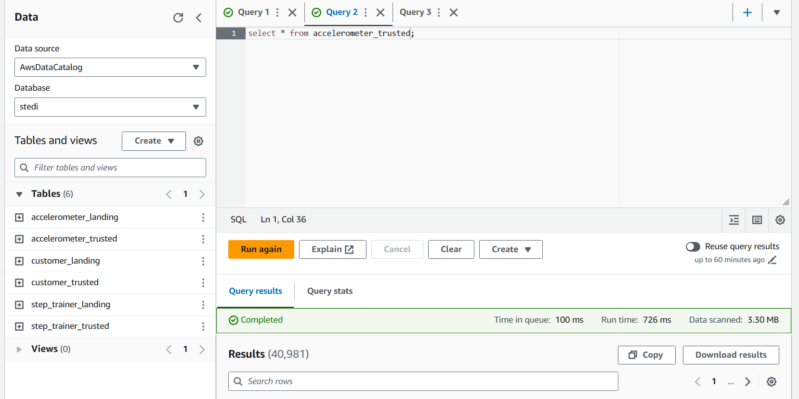

# Project: STEDI-Human-Balance-Analytics

## Contents

+ [Problem Overview](#Problem-Overview)
+ [Project Data](#Project-Data)
+ [Workflow](#Workflow)

## Problem Overview

The STEDI Team has been hard at work developing a hardware STEDI Step Trainer that:
- trains the user to do a STEDI balance exercise
- has sensors on the device that collect data to train a machine-learning algorithm to detect steps
- has a companion mobile app that collects customer data and interacts with the device sensors

STEDI has heard from millions of early adopters who are willing to purchase the STEDI Step Trainers and use them.

Several customers have already received their Step Trainers, installed the mobile application, and begun using them together to test their balance. The Step Trainer is just a motion sensor that records the distance of the object detected. The app uses a mobile phone accelerometer to detect motion in the X, Y, and Z directions.

The STEDI team wants to use the motion sensor data to train a machine learning model to detect steps accurately in real-time. Privacy will be a primary consideration in deciding what data can be used.

Some of the early adopters have agreed to share their data for research purposes. Only these customers’ Step Trainer and accelerometer data should be used in the training data for the machine learning model.

### What we need to do

As a data engineer on the STEDI Step Trainer team, you'll need to extract the data produced by the STEDI Step Trainer sensors and the mobile app, and curate them into a data lakehouse solution on AWS so that Data Scientists can train the learning model.

## Project Data

* Customer Records: This is the data from fulfillment and the STEDI website.  
* Step Trainer Records: This is the data from the motion sensor.
* Accelerometer Records: This is the data from the mobile app.

## Workflow

Landing Zone

> To simulate the data coming from the various sources, we will need to create our own S3 directories for customer_landing, step_trainer_landing, and accelerometer_landing zones, and copy the data there as a starting point

We create two Glue tables for the two landing zones and using Athena to query.

- Customer Landing:

- The customer_landing data contains multiple rows with a blank shareWithResearchAsOfDate.

- Accelerometer Landing: 

- Step Trainer Landing: 

Trusted Zone

- Only cutomers who agreed to share their data for research purposes (Trusted Zone) - creating a Glue Table called **customer_trusted**.
- Only Accelerometer Readings from customers who agreed to share their data for research purposes (Trusted Zone) - creating a Glue Table called **accelerometer_trusted**.

[1. customer_landing_to_trusted.py](landing_to_trusted/customer_landing_to_trusted.py) - It has a node that drops rows that do not have data in the sharedWithResearchAsOfDate column.

- The customer_trusted data does NOT contains rows with a blank shareWithResearchAsOfDate.

[2. accelerometer_landing_to_trusted.py](landing_to_trusted/accelerometer_landing_to_trusted.py) - It has a node that inner joins the customer_trusted data with the accelerometer_landing data by emails.

[3. step_trainer_trusted.py](landing_to_trusted/step_trainer_trusted.py) - It has a node that inner joins the step_trainer_landing data with the customer_curated data by serial numbers

Curated Zone

[customer_trusted_to_curated.py](trusted_to_curated/customer_trusted_to_curated.py) - It has a node that inner joins the customer_trusted data with the accelerometer_trusted data by emails. Only customers who have accelerometer data and have agreed to share their data for research called customers_curated.

[machine_learning_curated.py](trusted_to_curated/machine_learning_curated.py): It has has a node that inner joins the step_trainer_trusted data with the accelerometer_trusted data by sensor reading time and timestamps.

